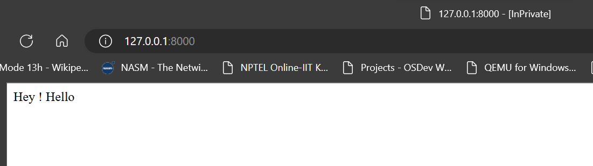

## Routes

## What Is a Route?
The route is a way of creating a request URL for your application. These URLs do not have to map to specific files on a website, and are both human readable and SEO friendly.

In Laravel, routes are created inside the routes folder. They are created in the web.php file for websites. And for APIs, they are created inside api.php.

> routes/web.php     -> All web routes are defined here

### Here is how the root route for web in web.php looks like:
```

// Creating a new route, This one is root route
Route::get('/', function() {
    return 'Hey ! Hello';
});

```
> Output :-




### Here is how the custom route for web in web.php looks like:

```
// Creating a new route
Route::get('/sayJaat', function() {
    return 'Hey ! Mr. Jaat';
});

```
> Output :-

