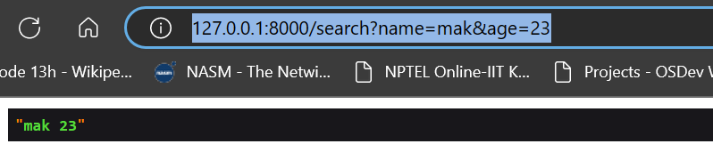

## Routes

## What Is a Route?
The route is a way of creating a request URL for your application. These URLs do not have to map to specific files on a website, and are both human readable and SEO friendly.

In Laravel, routes are created inside the routes folder. They are created in the web.php file for websites. And for APIs, they are created inside api.php.

> routes/web.php     -> All web routes are defined here

> There is following types of route methods

1. GET
2. POST
3. PUT
4. DELETE
5. PATCH
6. OPTIONS

---

### Syntax: To write route is as given below:

```
// Syntax of a route
Route::request_type('/url', 'function()');
```
* This function takes two parameters, 1) endpoint, 2) closure

### Here is how the root route for web in web.php looks like:
```

// Creating a new route, This one is root route
Route::get('/', function() {
    return 'Hey ! Hello';
});

```
> Output :-


### Here is how the custom route for web in web.php looks like:

```
// Creating a new route
Route::get('/sayJaat', function() {
    return 'Hey ! Mr. Jaat';
});

```
> Output :-


### Routing With Parameters - Passing url wildcards:

> passed url = http://127.0.0.1:8000/sayJaat/7

```
Route::get('/sayJaat/{id}', function($id) {
    return 'Hey ! Mr. Jaat your id = '. $id;
});
```


### passing optional parameters:

> passed url = http:127.0.0.1:8000/passed_data/man/7

```
Route::get('/pass_data/{name}/{id?}', function ($name, $id = null) {
    $data = compact('name', 'id');
    print_r($data);
});
```

Description = Here we need to pass name as mandatory parameters but id is an optional one.

The compact() function creates an array from variables and their values.

Note: Any strings that does not match variable names will be skipped.

The print_r() function prints the information about a variable in a more human-readable way.


#### with response method

```
Route::get('/sayJaat/{id}', function($id) {
    return response('Hey ! Mr. Jaat your id = '. $id);
});
```

Same output as above


### Constraints to wildcard

Suppose if we want user to just enter number as wildcard.

```
Route::get('/sayJaat/{id}', function($id) {
    return 'Hey ! Mr. Jaat your id = '. $id;
})->where('id','[0-9]+');
```

* Now if the user enters wildcard other than number it will show 404 not found.

### Laravel Routing With Optional Parameters

```
Route::get('/page/{test?}', function ($test = 'tutsmake') {

    echo "Welcome to ". $test;

});
```


---

### return by response method:

```
Route::get('/response', function () {
    return response('Welcome');
});
```


> Render html by response

```
Route::get('/response', function () {
    return response('<h1>Welcome<h1>');
});
```


## Url Query String

> Input Url = http://127.0.0.1:8000/search?name=mak&age=23

```
// include this class in web.php for Request object
use Illuminate\Http\Request;
```
```
// Query parameter
Route::get('/search', function(Request $request){
        dd($request);
});
```


> More specific example:-

```
// Query parameter
Route::get('/search', function(Request $request){
        dd($request->name . ' ' . $request->age);
});
```



> or just return

```
// Query parameter
Route::get('/search', function(Request $request){
        return($request->name . ' ' . $request->age);
});
```

---
## Returning View:

Instead of just returning strings, we are going to return webpages when someone visits a route. Let’s see how we can do that. First of all create a file called welcome.blade.php in resources/views. In Laravel we have a built-in templating engine called Blade thus we write all of our webpages in *.blade.php not *.html.


> routes/web.php

```
// Creating a new route
Route::get('/', function() {
    return view('welcome');
});
```
> resourcs/view/welcome.blade.php

```
<!DOCTYPE html>
<html lang="en">
    <body>
        <h1>Hello! World from the View</h1>
    </body>
</html>
```

> Output :-


## Passing data to view from route.

* send from the route

```
// Passing Data to view
Route::get('/welcome', function() {
    return view('welcome', [
        'heading' => 'This is a heading.'
    ]);
});
```

* recieve in the view

```
<!DOCTYPE html>
<html lang="en">
    <body>
        <h1><?php echo $heading; ?></h1>
    </body>
</html>
```

This will print "This is a heading".

> More deep

* Sender Route

```
// Passing Data to view
Route::get('/welcome', function() {
    return view('welcome', [
        'heading' => 'This is a heading.',
        'data' => [
            [
                'id' => 1,
                "title" => 'The Delhi cold.',
                "description" => 'Actually delhi cold is not so
                cold  but the immunity of people is less than the
                villagers. I had spent my new year in my village
                and at that there I used to wear many layer than
                here in the delhi.'
            ],

            [
                'id' => 2,
                "title" => 'The Delhi cold...',
                "description" => 'Actually delhi cold is not so
                cold  but the immunity of people is less than the
                villagers. I had spent my new year in my village
                and at that there I used to wear many layer than
                here in the delhi.'
            ]
        ]
    ]);
});

```

* Reciever View

```
<!DOCTYPE html>
<html lang="en">
    <body>
        <h1><?php echo $heading; ?></h1>
        <?php foreach ($data as $data): ?>
            <h2><?php echo $data['title']; ?></h2>
            <p><?php echo $data['description']; ?></p>
        <?php endforeach; ?>
    </body>
</html>
```


----

## Routes with controllers:

Laravel provides us much more power than just writing a direct callback function. We can actually make our routes point to a function inside the controllers. To do so let’s manually create our controller first and call it mycontroller. Just go to app/Http/Controllers and create a file called mycontroller.php. Write following code in this file:

> To create the controller use the follow command :-

```
php artisan make:controller myController
```

> This will create a controller named as myController in the location - app\Http\Controllers\myController.php

* This file contains the myController class inherited from Controller class.

```
class myController extends Controller
{
    //
}
```

Modify the myController class as below -

```
class mycontroller extends Controller {
    public function index() {
        return view('welcome'); // view name
    }
}

```

> Add the route in route/web.php

syntax = Route::request_type('/url', 'ControllerName@functionName');
```
Route::request_type('/url', 'ControllerName@functionName');
```

---

## debugging methods 

1. dd = die dump

```
Route::get('/sayJaat/{id}', function($id) {
    dd($id);
    return 'Hey ! Mr. Jaat your id = '. $id;
})->where('id','[0-9]+');

```
* It will dump the id variable and stop the executon at that statement.


2. ddd = die dump debug

```
Route::get('/sayJaat/{id}', function($id) {
    ddd($id);
    return 'Hey ! Mr. Jaat your id = '. $id;
})->where('id','[0-9]+');
```

* It is more specific, it shows the id value, location in the code.
